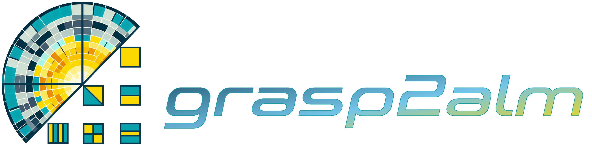

<p align="center">
  <h1>
  
  </h1>
</p>

[](https://yusuke-takase.github.io/grasp2alm/index.html)


This package supports the conversion from beam data calculated using [GRASP](https://www.ticra.com/software/grasp/) for CMB experiments to spherical harmonic coefficients ($a_{lm}$) based on the [HEALPix](https://healpix.sourceforge.io/) framework.
The code is designed based on [Beam](https://github.com/zonca/planck-levelS/tree/master/Beam), which is part of [LevelS](https://github.com/zonca/planck-levelS), the pipleline of the Planck experiment.

## Instllation

```
pip install grasp2alm
```

Or you can install from source by:

```
git clone https://github.com/yusuke-takase/grasp2alm
cd grasp2alm
pip install -e .
```
