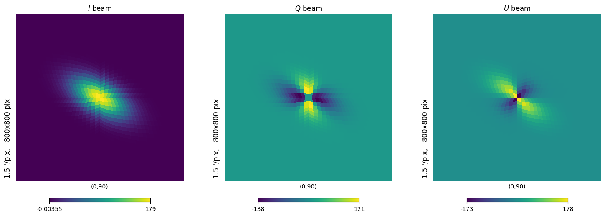

Gaussian beam
=============

The :class:`.BeamGauss` class models a Gaussian beam and provides methods to compute its properties and represent it in terms of spherical harmonics. The key mathematical concepts and formulas used in this class are described below.

Real space representation
-------------------------

:meth:`.BeamGauss.gaussian_beam()`: Computes the value of the Gaussian beam at a given angle :math:`\theta`.

A Gaussian beam is characterized by its Full Width at Half Maximum (FWHM) and amplitude. The beam profile as a function of angle :math:`\theta` is given by:

.. math::
   B(\theta) = A \exp\left(-\frac{\theta^2}{2\sigma^2}\right)

where:

* :math:`A` is the amplitude of the beam.
* :math:`\sigma` is the standard deviation of the Gaussian, related to the FWHM by :math:`\sigma = \frac{\text{FWHM}}{\sqrt{8 \ln 2}}`.

Spherical Harmonics Representation
----------------------------------

:meth:`.BeamGauss.get_alm()`: Computes the spherical harmonics coefficients :math:`a_{\ell m}` for the beam.

The beam can be represented in terms of spherical harmonics :math:`a_{\ell m}`. For a circular Gaussian beam, the coefficients are given by:

.. math::
   a_{\ell 0} = \sqrt{\frac{2\ell + 1}{4\pi}} \exp\left(-\frac{\ell(\ell + 1)\sigma^2}{2}\right)

For an elliptical Gaussian beam, the coefficients are more complex and involve modified Bessel functions of the first kind :math:`I_v(x)`:

.. math::
   a_{\ell m} = \sqrt{\frac{2\ell + 1}{4\pi}} \exp\left(-\frac{\ell(\ell + 1)\sigma_x^2 (1 - e^2/2)}{2}\right) I_{\frac{m}{2}}\left(\frac{\ell(\ell + 1)\sigma_x^2 e^2}{4}\right)

where:
- :math:`\sigma_x` is the standard deviation along the major axis of the ellipse.
- :math:`e` is the ellipticity of the beam.

Polarization
------------

The class also supports polarized beams, where the polarization angle :math:`\psi_{\text{pol}}` and cross-polar leakage are taken into account. The spherical harmonics coefficients for the polarized components are adjusted accordingly.

Circular Beam
-------------

For a circular Gaussian beam, the spherical harmonics coefficients :math:`a_{\ell m}` are computed as follows:

.. math::
   a_{\ell 0} = \sqrt{\frac{2\ell + 1}{4\pi}} \exp\left(-\frac{\ell(\ell + 1)\sigma^2}{2}\right)

If the beam is polarized, the coefficients for the polarized components are given by:

.. math::
   a_{\ell 2} = \sqrt{\frac{2\ell + 1}{32\pi}} \exp\left(-\frac{\ell(\ell + 1)\sigma^2}{2}\right) \left(\cos(2\psi_{\text{pol}}) - i\sin(2\psi_{\text{pol}})\right)

Elliptical Beam
---------------

For an elliptical Gaussian beam, the coefficients are more complex and involve modified Bessel functions of the first kind :math:`I_v(x)`:

.. math::
   a_{\ell m} = \sqrt{\frac{2\ell + 1}{4\pi}} \exp\left(-\frac{\ell(\ell + 1)\sigma_x^2 (1 - e^2/2)}{2}\right) I_{\frac{m}{2}}\left(\frac{\ell(\ell + 1)\sigma_x^2 e^2}{4}\right)

where:

* :math:`\sigma_x` is the standard deviation along the major axis of the ellipse.
* :math:`e` is the ellipticity of the beam.

For the polarized components, the coefficients are adjusted based on the polarization angle :math:`\psi_{\text{pol}}` and the inclination angle :math:`\psi_{\text{ell}}`:

.. math::
   a_{\ell m} = \sqrt{\frac{2\ell + 1}{8\pi}} \exp\left(-\frac{\ell(\ell + 1)\sigma_x^2 (1 - e^2/2)}{2}\right) \left(\cos(2(\psi_{\text{pol}} - \psi_{\text{ell}})) - i\sin(2(\psi_{\text{pol}} - \psi_{\text{ell}}))\right)

Cross-Polar Leakage
-------------------

The multipoles are adjusted for cross-polar leakage by scaling the coefficients:

.. math::
   a_{\ell m} \rightarrow a_{\ell m} (1 + \text{cross\_polar\_leakage})

Normalization
-------------

Finally, the coefficients are normalized:

.. math::
   a_{\ell m} \rightarrow a_{\ell m} \times -\sqrt{2}

Get beam map
------------
:meth:`.BeamGauss.get_profile()`: Provides the beam map profile at a given `nside`.

Example Usage
-------------

.. code-block:: python

    from grasp2alm import BeamGauss

    # Initialize a Gaussian beam with FWHM of 1 degree and amplitude of 1
    beam = BeamGauss(fwhm_deg=4.0, amplitude=1.0)

    # Compute the value of the beam at 0.5 degrees
    theta = np.linspace(0, np.pi/2, 1000)
    value = beam.gaussian_beam(theta)

    # Compute the spherical harmonics coefficients up to lmax=10
    alm = beam.get_alm(
        lmax=500,
        mmax=500,
        ellipticity=0.5,
        psi_ell_rad=np.pi / 6,
        psi_pol_rad=0.0,
        cross_polar_leakage=0.0,
    )

    # Get the beam profile at nside=64
    beam_map = beam.get_profile(nside=128)

    plt.figure(figsize=(15,5))
    hp.gnomview(beam_map[0], rot=[0, 90], xsize=800, title='$I$ beam', sub=(1,3,1))
    hp.gnomview(beam_map[1], rot=[0, 90], xsize=800, title='$Q$ beam', sub=(1,3,2))
    hp.gnomview(beam_map[2], rot=[0, 90], xsize=800, title='$U$ beam', sub=(1,3,3))

